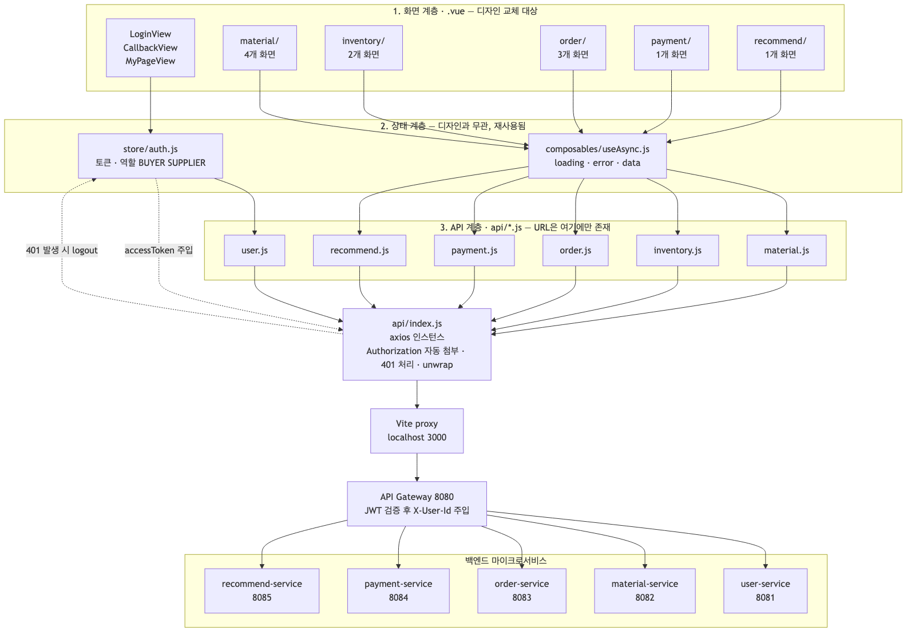
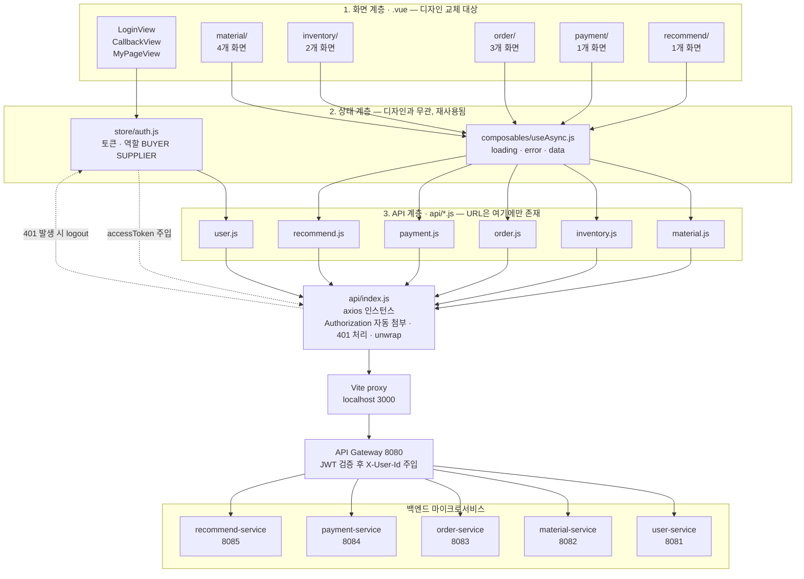
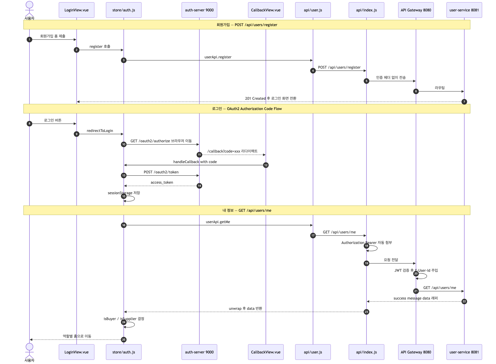
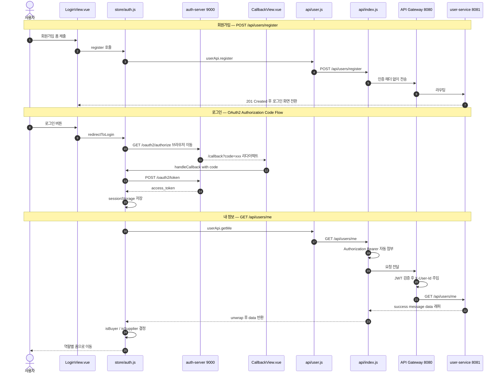
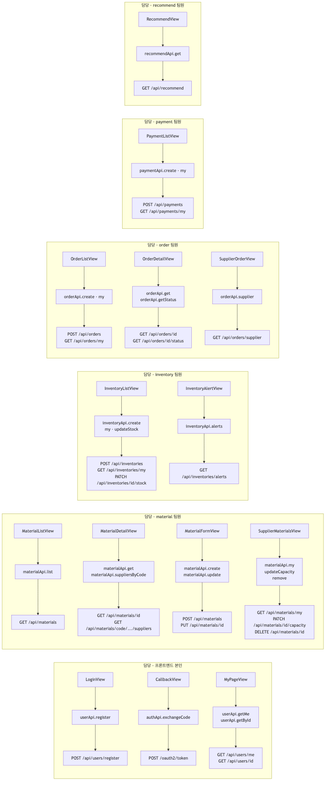
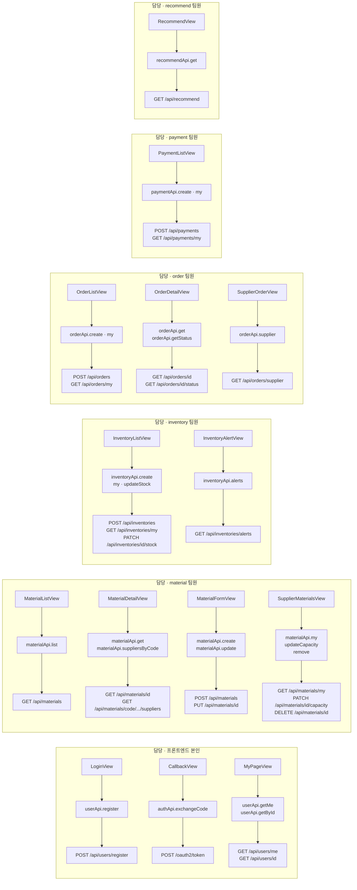
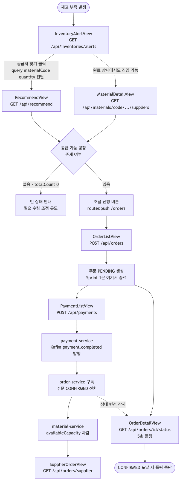
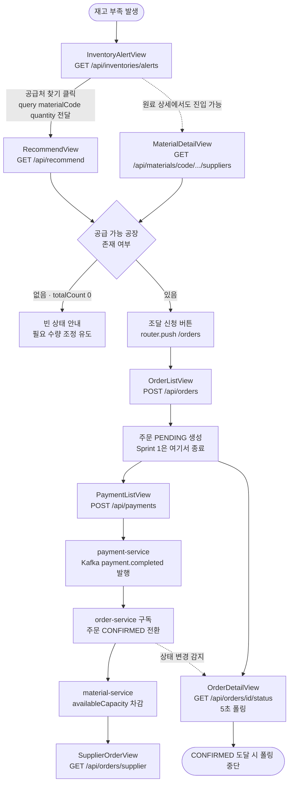

# 6. 프론트엔드 API 호출 배선 흐름

> 구현 완료된 `msa-MyService/vue-frontend` 기준.
> 모든 다이어그램은 mermaid-cli로 렌더링 검증을 마쳤으며, 원본 `.mmd`와 `.png`는 `06-배선흐름-images/`에 있다.

---

## 1. 레이어 배선 — 화면부터 마이크로서비스까지

프론트엔드는 3개 계층으로 분리되어 있고, 각 계층은 아래 계층만 호출한다.

| 계층 | 위치 | 책임 | 디자인 변경 영향 |
|---|---|---|---|
| 1. 화면 | `views/*.vue` | 마크업과 렌더링만 | **교체 대상** |
| 2. 상태 | `store/auth.js`, `composables/useAsync.js` | 토큰·역할, loading/error/data | 영향 없음 |
| 3. API | `api/*.js` | HTTP 호출. **URL은 여기에만 존재** | 영향 없음 |

`api/index.js`(axios 인스턴스)가 세 가지를 가로챈다.

1. **요청**: `store/auth.js`의 `accessToken`을 `Authorization: Bearer`로 자동 첨부
2. **응답**: `{ success, message, data }` 래퍼에서 `data`만 꺼내 반환(`unwrap`)
3. **401**: 토큰을 폐기하고 `/login`으로 이동

> `X-User-Id`는 프론트가 보내지 않는다. API Gateway가 JWT를 검증한 뒤 백엔드로 주입한다.
> 그래서 "내 것" 조회는 경로에 id를 넣지 않고 `/me`, `/my`를 쓴다.

mermaid 원본

---

## 2. 로그인 배선 — OAuth2 Authorization Code Flow

**핵심 지점 3가지**

- **`GET /oauth2/authorize`는 axios 호출이 아니다.** `window.location.href`로 브라우저를 통째로 이동시킨다(CORS 대상 아님).
- **`POST /oauth2/token`은 공통 axios 인스턴스를 쓰지 않는다.** `Content-Type`이 `application/x-www-form-urlencoded`이고 인증이 `Basic`이라 형식이 다르다.
- **`GET /api/users/me`의 응답이 역할 분기의 기준점이다.** 여기서 받은 `role`로 `isBuyer`/`isSupplier`가 결정되고, 헤더 메뉴·라우터 가드·버튼 노출이 모두 여기에 연결된다.

mermaid 원본

---

## 3. 화면 → API 함수 → 엔드포인트 매핑

| 담당 | 화면 | API 함수 | 엔드포인트 |
|---|---|---|---|
| **본인** | LoginView | `userApi.register` | `POST /api/users/register` |
| **본인** | CallbackView | `authApi.exchangeCode` | `POST /oauth2/token` |
| **본인** | MyPageView | `userApi.getMe` / `getById` | `GET /api/users/me` / `GET /api/users/{id}` |
| material | MaterialListView | `materialApi.list` | `GET /api/materials` |
| material | MaterialDetailView | `materialApi.get` / `suppliersByCode` | `GET /api/materials/{id}` / `GET /api/materials/code/{code}/suppliers` |
| material | MaterialFormView | `materialApi.create` / `update` | `POST /api/materials` / `PUT /api/materials/{id}` |
| material | SupplierMaterialsView | `materialApi.my` / `updateCapacity` / `remove` | `GET /api/materials/my` / `PATCH /api/materials/{id}/capacity` / `DELETE /api/materials/{id}` |
| inventory | InventoryListView | `inventoryApi.create` / `my` / `updateStock` | `POST /api/inventories` / `GET /api/inventories/my` / `PATCH /api/inventories/{id}/stock` |
| inventory | InventoryAlertView | `inventoryApi.alerts` | `GET /api/inventories/alerts` |
| order | OrderListView | `orderApi.create` / `my` | `POST /api/orders` / `GET /api/orders/my` |
| order | OrderDetailView | `orderApi.get` / `getStatus` | `GET /api/orders/{id}` / `GET /api/orders/{id}/status` |
| order | SupplierOrderView | `orderApi.supplier` | `GET /api/orders/supplier` |
| payment | PaymentListView | `paymentApi.create` / `my` | `POST /api/payments` / `GET /api/payments/my` |
| recommend | RecommendView | `recommendApi.get` | `GET /api/recommend` |

mermaid 원본

---

## 4. 핵심 시나리오 배선 — 재고 부족부터 수주 확인까지

화면 간 값 전달은 **라우터 query**로 한다. 전역 상태를 만들지 않아, 화면을 재배치해도 배선이 끊기지 않는다.

- 부족 알림 → 추천: `router.push('/recommend?materialCode=...&quantity=...')`
- 공급처 → 조달 신청: `router.push('/orders?materialId=...&quantity=...')`

**Sprint 경계**: Sprint 1에서는 주문이 `PENDING`에서 멈춘다. 결제(Sprint 2)가 붙어
`payment.completed` 이벤트가 발행되어야 `CONFIRMED`로 전환된다.
`OrderDetailView`는 `PENDING`인 동안에만 5초 간격으로 상태를 폴링하고, 종료 상태에 도달하면 폴링을 멈춘다.

mermaid 원본

---

## 5. 배선 규약 요약

| 규약 | 이유 |
|---|---|
| HTTP 호출은 `api/`에만 둔다 | 화면이 URL을 모르므로, 엔드포인트가 바뀌어도 화면은 그대로다 |
| 비동기 상태는 `useAsync`로 감싼다 | `run()`은 예외를 던지지 않고 `{ ok }`를 반환해, 화면마다 try/catch를 반복하지 않는다 |
| 응답 언랩은 api 모듈에서 끝낸다 | 화면에서 `res.data.data`를 파지 않는다 |
| 권한 분기는 `auth` 스토어만 본다 | 역할 판단이 한 곳에 있어 메뉴·가드·버튼이 함께 움직인다 |
| 컴포넌트에 `scoped style`을 쓰지 않는다 | 디자인 교체 시 `global.css`만 바꾸면 된다 |
| 빈 결과는 에러가 아니다 | `totalCount === 0`은 정상 응답이므로 `.empty` 안내를 렌더링한다 |
